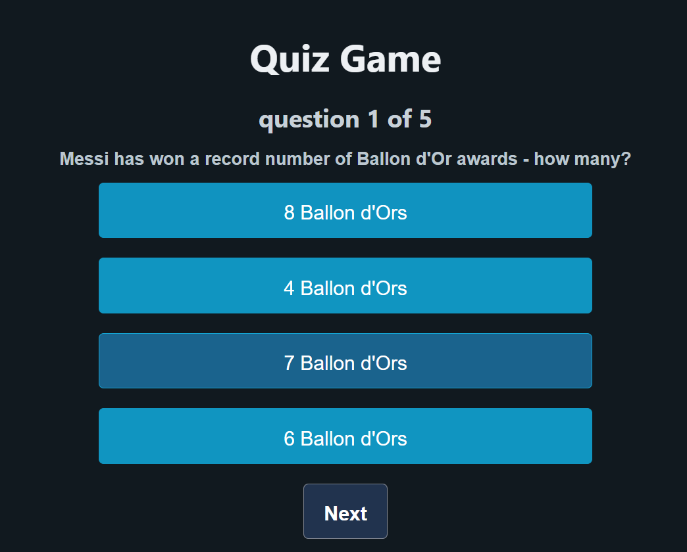

# Quiz Game ⁉️🧠

## 🕹️ Description

This is a simple quiz game made with HTML, CSS, and JavaScript.
The player chooses one of the multiple choices. If the choice is correct the player will get +1 score.  
If the player score is 3 or more he passes(win), else he lose or fail.

## 🚀 Getting Started

👉 **Play it here:** [https://alinasser-02.github.io/browser-quiz-game/]

👉 **Planning Materials:**

- [User Stories](./planning/user-stories.md)
- [excalidraw](./planning/excalidraw.png)

### How to Play

1. Open the link to the game.
2. Select category and click start quiz.
3. read the question then choose one of the answers and click next.
4. After the final question, the score is shown and you can play again!

## 💡 Technologies Used

- HTML
- CSS
- JavaScript

## 🚧 Next Steps

- Add animations
- Make it work on different devices
